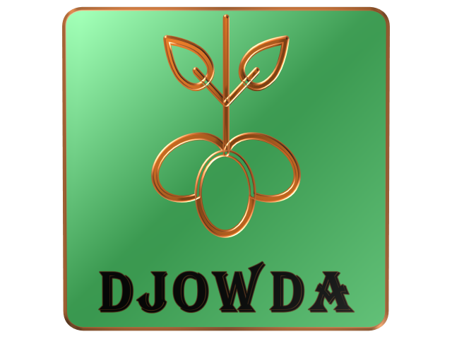
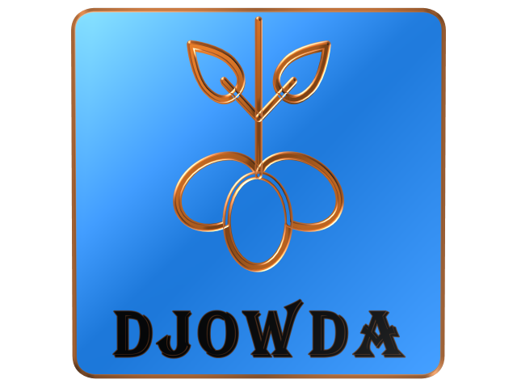
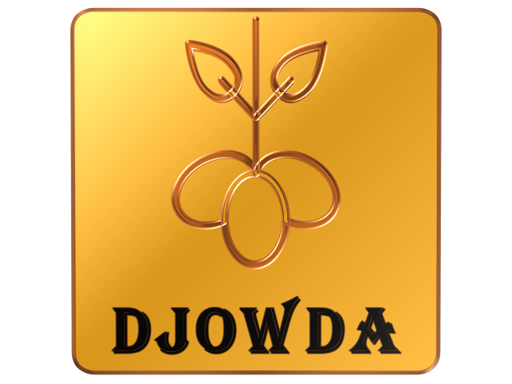

markdown
# Djowda-UserApp (Work in progress...)

# Djowda-UserApp
The official user-facing app for Djowda, allowing customers to browse nearby stores, view product availability, place orders, and track delivery status. Designed for a seamless e-grocery shopping experience.

# Introduction

## Brief Overview of the User App: Its Purpose and Role in the Djowda Platform

The User App in the Djowda platform is designed to serve as the primary interface for end-users to interact with the system. Its main purpose is to provide users with access to various fresh food-related data and services. This app allows users to browse, order, and receive fresh food products such as vegetables, fruits, and possibly fish from different sources such as restaurants, stores, and farmers. It integrates with other apps within the Djowda ecosystem to ensure a seamless experience for users, from placing an order to delivery.

## High-Level Benefits and Features for Users

* **Convenience:** Users can easily browse and order fresh food from multiple sources through a single app.
* **Variety:** Access to a wide range of fresh food products including vegetables, fruits, and fish.
* **Real-Time Updates:** Users receive real-time updates on their orders, including delivery status.
* **Personalization:** The app can provide personalized recommendations based on user preferences and past orders.
* **Integration:** Seamless integration with other apps in the Djowda platform ensures efficient order processing and delivery.
* **Food Support Requests:** Users can request free food assistance. When a request is made, all stockholders receive a notification, and a random individual or entity from a pool of volunteers is assigned to provide the necessary help.
* **AI Assistance:** The app includes AI-driven chat and voice assistance to help users with their queries and provide support throughout their experience.
* **Educational Content:** The app provides educational content about healthy eating and nutrition to encourage better food choices.
* **Community Support:** Users can engage with the community, including selling, donating, and exchanging food from their gardens.

## User App Interactions with Other Apps

### User App Interactions with Other Apps

| App                  | Direct Interaction with User App? | Indirect Interaction with User App? |
|----------------------|:---------------------------------:|:-----------------------------------:|
|  Store App            | X                                 |                                     |
|  Farmer App           | X                                 |                                     |
|  Delivery Men App     | X                                 |                                     |
|  Store Admin App      | X                                 |                                     |
|  Restaurants App      | X                                 |                                     |
|  App for Seed Providers | X                               |                                     |
|  User App             | X                                 |                                     |
|  AI Assistance        | X                                 |                                     |
|  Transport App        |                                   | X                                   |
|  Factory App          |                                   | X                                   |
|  Whole Seller App     |                                   | X                                   |

